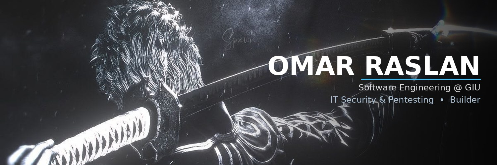

---

### 👋 About Me

- 🎓 Software Engineering student at the **German International University (GIU)**, Cairo
- 🛡️ On the **IT Security** track, heading toward **penetration testing**
- 🛠️ Solo builder: web apps, iOS apps, games, browser extensions and hardware projects
- ⚡ I like shipping real products people use: from a Raspberry Pi AC controller to a university app that syncs with the student portal
- 📍 Based in Cairo, Egypt

---

### 🧰 Tech Stack

**Languages**

**Frontend & Mobile**

**Backend & Data**

**Tools, Cloud & Hardware**

---

### 🚀 Featured Projects

<table>
<tr>
<td width="50%" valign="top">

#### 🌡️ [AcController](https://github.com/Omar-Raslan-16006931/AcController)
Smart AC controller: a **Raspberry Pi** sends IR signals, controlled from a **React** web app and an **iOS** app with Dynamic Island. FastAPI backend, Supabase auth with passkeys, schedules, IR learning and usage analytics.

`React` `FastAPI` `Raspberry Pi` `Supabase` `iOS`

</td>
<td width="50%" valign="top">

#### 🎓 [UniMate](https://github.com/Omar-Raslan-16006931/myunimate)
All-in-one university app: schedule, grades, to-dos, a gym tracker and an AI assistant. A **Supabase Edge Function** syncs grades, attendance and exam seats from the university portal and sends push alerts.

`React` `TypeScript` `Supabase` `Gemini` `Capacitor`

</td>
</tr>
<tr>
<td width="50%" valign="top">

#### 💼 [GIU Nexus](https://github.com/Omar-Raslan-16006931/giu-nexus)
Team **MERN** platform that matches GIU students with jobs and internships: JWT + OTP auth, recruiter dashboards, an admin panel and AI job recommendations.

`MongoDB` `Express` `React` `Node.js` `Docker`

</td>
<td width="50%" valign="top">

#### 🛠️ [Campus Maintenance](https://github.com/Omar-Raslan-16006931/campus-maintenance)
Report and resolve campus maintenance requests. **NestJS** API with Swagger, **Next.js** + shadcn/ui frontend, MongoDB Atlas, CI and a spec-driven workflow.

`NestJS` `Next.js` `MongoDB` `GitHub Actions`

</td>
</tr>
<tr>
<td width="50%" valign="top">

#### 🕌 [Noor](https://github.com/Omar-Raslan-16006931/Noor)
Islamic assistant with prayer times, Qibla compass, Quran tracker, Zakat calculator and AI guidance.

`React` `TypeScript` `Supabase` `Gemini`

</td>
<td width="50%" valign="top">

#### 🎮 [Steam Price Overlay](https://github.com/Omar-Raslan-16006931/SteamOverlay)
Always-on-top **Electron** overlay that converts Steam store prices between 160+ currencies in real time, with a click-through lock mode and hotkeys.

`Electron` `JavaScript`

</td>
</tr>
</table>

---

### 📊 GitHub Stats

---

### 🤝 Let's Connect

